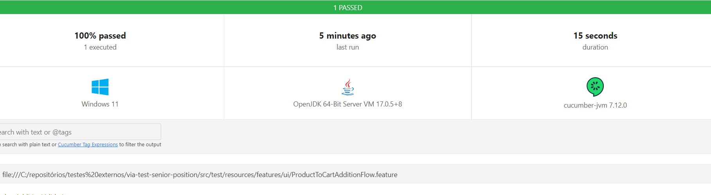

# Via test for a senior position

## Description:

This is a Maven project that gathers the following frameworks: Selenium WebDriver, Cucumber and JUnit. 

The goal is to test the following scenario:
* Add 2 products in the cart and verify if they were added successfully.

The test is ready to receive any number of products, since they are parameterized using cucumber + gherkin (ProductToCartAdditionFlow.feature), as follows:

| product           | size           | colour        | quantity     |
| -------------     | -------------  | ------------- |------------- |
| Abominable Hoodie | XS             | Blue          |2             |

The test flow comprises the following steps:
* first of all, navigate to the website
* click on "COMPRAR" menu option on the top of the page
* click on the product parameterized that appears
* select the parameterized size and colour
* add the parameterized quantity
* click on "COMPRAR" button (this one with the cart icon)
* validate if an alert appears showing the number of products added to the cart

## Design Pattern

Page Object.

## Pre-requesites to run the test scenarios:

You should have in your machine:
* Maven 3.8.0
* Google Chrome Browser downgraded to 112.0.5615.49*

<h5>* The current Google Chrome version is above 113, but Selenium doesn't have this implementation yet, so if your browser version is above 113, the tests will run, but can show some issues. If you want to use another browser version, you should replace the chromedriver.exe file, that's located in the `drivers` directory in the root, with the one that matches what you want/have. You can find a list of driver executables <a href="http://chromedriver.storage.googleapis.com/index.html">here.</a></h5> 

## Test!

Open a console and execute the following command line in the project root: 

> mvn test

## Bonus: Reports

In the end of the test scenarios execution, a `reports` directory will be created in the project root. Inside it, you will find a file named test-report-ui.html. Click on it, and you will get something like this:

Enjoy 🎉